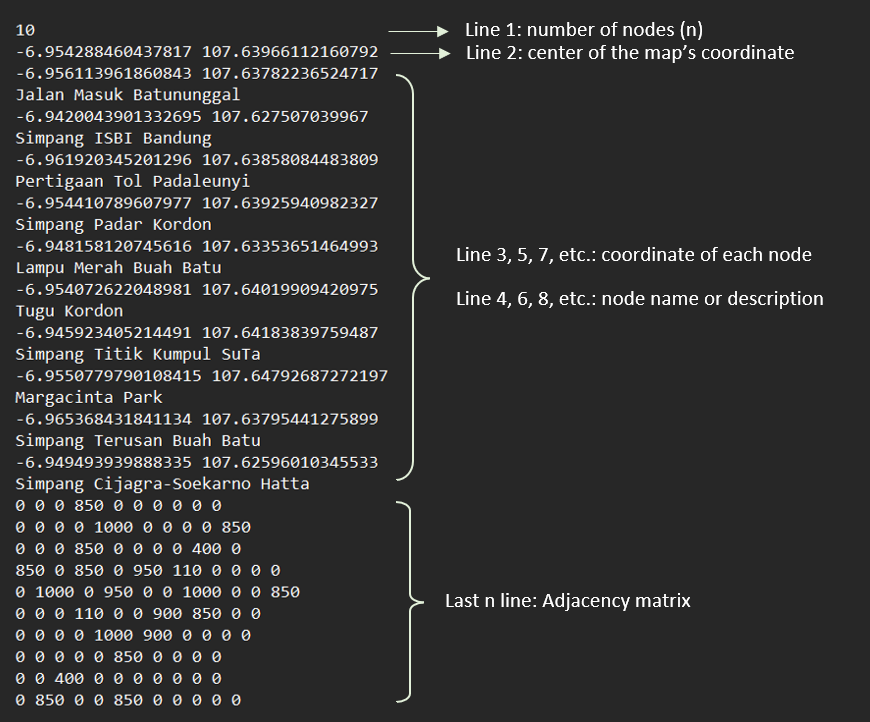
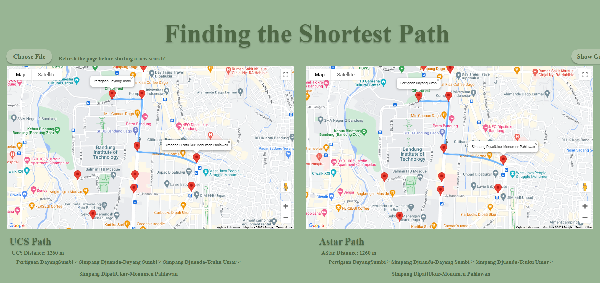
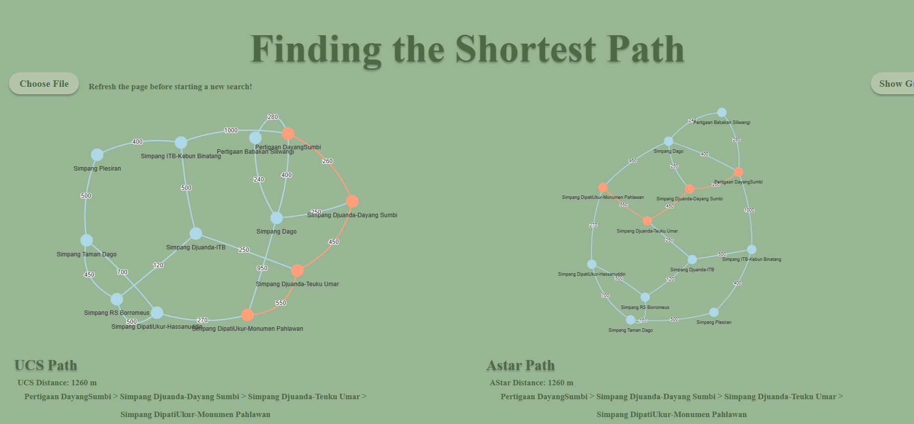

# IF2211_Strategi Algoritma

## *Tucil3_13521077_13521156*
Tugas Kecil 3 IF2211 Strategi Algoritma<br>
Implementasi Algoritma UCS dan A* untuk Menentukan Lintasan Terpendek

## **Table of Contents**
* [Program Description](#program-description)
* [Required Program](#required-program)
* [How to Run The Program](#how-to-run-the-program)
* [Implementation Screenshots](#implementation-screenshots)
* [Progress Report](#progress-report)
* [Folders and Files Description](#folders-and-files-description)
* [Author](#author)

## **Program Description**
This program is a web based program that uses JavaScript language along with html and CSS. The main of this program is to find the shortest path given the start and goal node using the UCS and A* algorithm. This program accept the map file input in txt, reading it, and displaying the map using the Google Maps API. This program is the node.js program with the app.js framework. This program uses express library that can be downloaded using this command:
```
npm install express googlemaps --save
```

## **Required Program**
* To run this program you need to install Node.js<br>
The installer can be downloaded from https://nodejs.org/en/download then follow the procedure to install Node.js
* To run the web program, you need to have Web Browser, like Google Chrome, Firefox, Edge, etc

## **How to Run The Program**
### How to Run The Web Program
* There are two alternatives to run the web program: <br>
  a. Run programs from folders
     * Open folder where this repository is saved
     * Go to `Web/src` folder
     * Open `index.html` file by double click the file or select the `index.html` file
       > You can choose the browser by select the `index.html` file, right-click, and choose browser in the "Open With"
  
  b. Run programs from terminal
     * Open the teminal/command prompt.
     * Locate your path to /Console/Web/src
     * Run the program by typing : `node app.js`
     * Open local host 3000 according to the port on app.js
* Enter a file by choose the "Choose File" button then selec one of the files in the test folder.
* Wait until the map is completely loaded along with the nodes or markers
> Note that on the page there are two maps : <br>The left map for determining routes with the UCS algorithm<br> The right map for determining routes with the A* algorithm.
* Select two different nodes as the origin and destination nodes. 
> Note that the process will not run if the two nodes have not been selected correctly.
* After the two nodes are selected, the path generated from the search will appear, along with the total distance and its visualization in the map.
* If you want to see the route search representation on the graph, press the "Show Graph" button at the top right.
* To perform the shortest path search process again, you need to refresh the page again and repeat the same steps

### How to Run The Console Program
* Open the teminal/command prompt.
* Locate your path to /Console/src
* Compile and run the mainProgram in the terminal by typing : <br>
`node mainProgram.js`

## Input File Restriction
* Input file is stored in the test folder
* Input node coordinates and adjacency matrices are stored in a file with .txt format consist of :
  * Line 1 specifies the number of nodes on the map
  * Line 2 specifies the coordinates for the center of the map view
  * Lines 3, 5, 7, and so on state the coordinates of each node on the map
  * Lines 4, 6, 8, and so on state the name or description of each node
  * The last n rows represent the adjacency matrices


* The number of node (n), coordinates, and elements of the adjacency matrix are numbers.
* Each coordinate consists of Latitude (latitude) and Longitude (longitude) coordinates separated by a space and is assumed to be correct or on the map.
* The adjacency matrix represents the actual distance between nodes in meters, with 0 representing that the nodes are not neighbours.
* Each edge represents a two-way street so that the adjacency matrix represents an undirected graph with the distance A to B = B to A

## **Implementation Screenshots**



## **Progress Report**

| Point | Yes | No |
|:------|:---:|----|
|The program is able read graph input | &check; |    |
|The program can estimate the shortest path using UCS algorithm | &check; |  |
|The program can estimate the shortest path using A* algorithm | &check; |  |
|The program can display the shortest path and its distance | &check; |  |
|The program can read map input and use google maps API to display the map and the shortest path on map | &check; |  |


## **Folders and Files Description**
```bash 
Tucil3_13521077_13521156
 ├── doc
 │   └── Tucil3_13521077_13521156.pdf
 ├── Console
 │   ├── node-modules
 │   ├── src  
 │   │   ├── Astar.js
 │   │   ├── UCS.js
 │   │   ├── input.js
 │   │   ├── output.js
 │   │   ├── mainProgram.js
 │   │   ├── operation.js
 │   │   ├── PriorityQueue.js
 │   │   └── package.json
 │   └── test
 ├── Web
 │   ├── node-modules
 │   ├── src 
 │   │   ├── app.js
 │   │   ├── Astar.js
 │   │   ├── UCS.js
 │   │   ├── graph.js
 │   │   ├── index.html
 │   │   ├── input.js
 │   │   ├── map.js
 │   │   ├── PriorityQueue.js
 │   │   ├── package-lock.json
 │   │   └── package.json     
 │   └── test
 ├── program.png
 └── README.md
```

## **Author**
| Nama | NIM |
|:-----|:---:|
| Husnia Munzayana | 13521077 |
| Brigita Tri Carolina | 13521156 |
